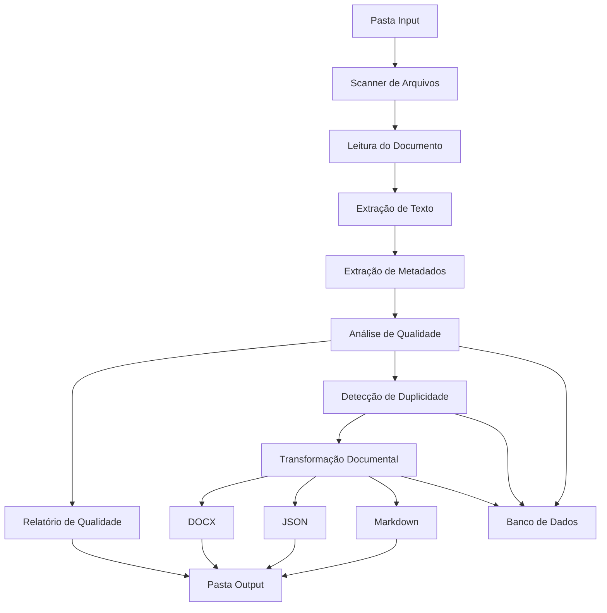

# Knowledge Quality Pipeline

## 1. Visão Geral

O Knowledge Quality Pipeline é uma aplicação desenvolvida para analisar, avaliar, padronizar e transformar documentos utilizados como fontes de conhecimento para agentes de Inteligência Artificial.
A solução atua como uma camada de preparação documental antes da utilização dos arquivos em pipelines RAG, garantindo maior qualidade, rastreabilidade e governança das informações utilizadas pelos agentes.

---

## 2.  Objetivo

Desenvolver uma aplicação Python modular capaz de:

- Processar documentos PDF, DOCX e XLSX
- Extrair texto e metadados
- Avaliar a qualidade documental
- Identificar duplicidades em documentos
- Gerar relatórios de análise
- Gerar versões transformadas dos documentos
- Exportar arquivos em:
  - Markdown (.md)
  - JSON (.json)
  - DOCX (.docx)
- Armazenar histórico de processamento
- Registrar transformações e resultados das análises

---

## 3. Arquitetura da Aplicação

### 3.1 Fluxo do Sistema



---

### 3.2 Estrutura de Pastas

```text
knowledge-quality-pipeline/

├── main.py

├── config/
│   └── settings.py

├── domain/
│   ├── document.py
│   └── quality_result.py

├── services/
│   ├── ingestion_service.py
│   ├── parser_service.py
│   ├── metadata_service.py
│   ├── quality_service.py
│   ├── duplicate_service.py
│   ├── transform_service.py
│   └── report_service.py

├── database/
│   ├── database.py
│   └── repository.py

├── storage/
│   ├── input/
│   ├── output/
│   ├── processed/
│   └── reports/

├── tests/

├── docs/

├── requirements.txt

└── README.md
```

### 3.3 Ferramentas utilizadas

| Camada | Tecnologia |
|----------|----------|
| Back-end | Python |
| Execução | CLI (Command Line Interface) |
| Banco de Dados | SQLServer |
| Testes | Pytest |
| Logs | Logging |
| Versionamento | Git |
| Containerização | Docker |
| Documentação | Markdown |

---

## 4. Escopo

### 4.1 Dentro do Escopo

- Leitura de arquivos PDF
- Leitura de arquivos DOCX
- Leitura de arquivos XLSX
- Extração de texto
- Extração de metadados
- Geração de score de qualidade documental
- Identificação de duplicidade por hash
- Geração de relatórios de qualidade
- Conversão para Markdown
- Conversão para JSON
- Conversão para DOCX padronizado
- Armazenamento de histórico de processamento
- Registro de transformações realizadas
- Exportação automática dos resultados para pasta Output

### 4.2 Fora do Escopo

- APIs REST
- Interface Web
- Dashboard
- Banco Vetorial
- Embeddings
- Busca Semântica
- Azure AI Search
- Copilot Studio
- Classificação através de LLM
- Workflow de aprovação

---

## 5. Requisitos Funcionais

### RF01

O sistema deve ler documentos localizados em uma pasta de entrada.

### RF02

O sistema deve identificar documentos novos para processamento.

### RF03

O sistema deve extrair conteúdo textual dos documentos.

### RF04

O sistema deve extrair metadados dos documentos.

### RF05

O sistema deve calcular um Score de Qualidade Documental.

### RF06

O sistema deve identificar duplicidade através de hash.

### RF07

O sistema deve registrar os resultados da análise.

### RF08

O sistema deve gerar um relatório de qualidade do documento.

### RF09

O sistema deve exportar o documento transformado em Markdown.

### RF10

O sistema deve exportar o documento transformado em JSON.

### RF11

O sistema deve exportar o documento transformado em DOCX.

### RF12

O sistema deve armazenar histórico de processamento.

### RF13

O sistema deve registrar todas as transformações realizadas nos documentos.

### RF14

O sistema deve permitir reprocessamento de documentos.

### RF15

O sistema deve exportar automaticamente arquivos e relatórios para a pasta Output.

---

## 6. Conclusão

O Knowledge Quality Pipeline será uma ferramenta especializada para preparação e governança de documentos utilizados em agentes de IA.

A aplicação possui uma arquitetura simples, modular e totalmente orientada a processamento back-end.

A solução permitirá:

- Padronizar fontes de conhecimento
- Melhorar a qualidade documental
- Detectar problemas antes da indexação
- Gerar relatórios automáticos
- Manter rastreabilidade das transformações
- Produzir documentos preparados para utilização futura em pipelines RAG

Essa abordagem cria uma base sólida para evolução futura da plataforma sem comprometer simplicidade, manutenção e velocidade de desenvolvimento do MVP.