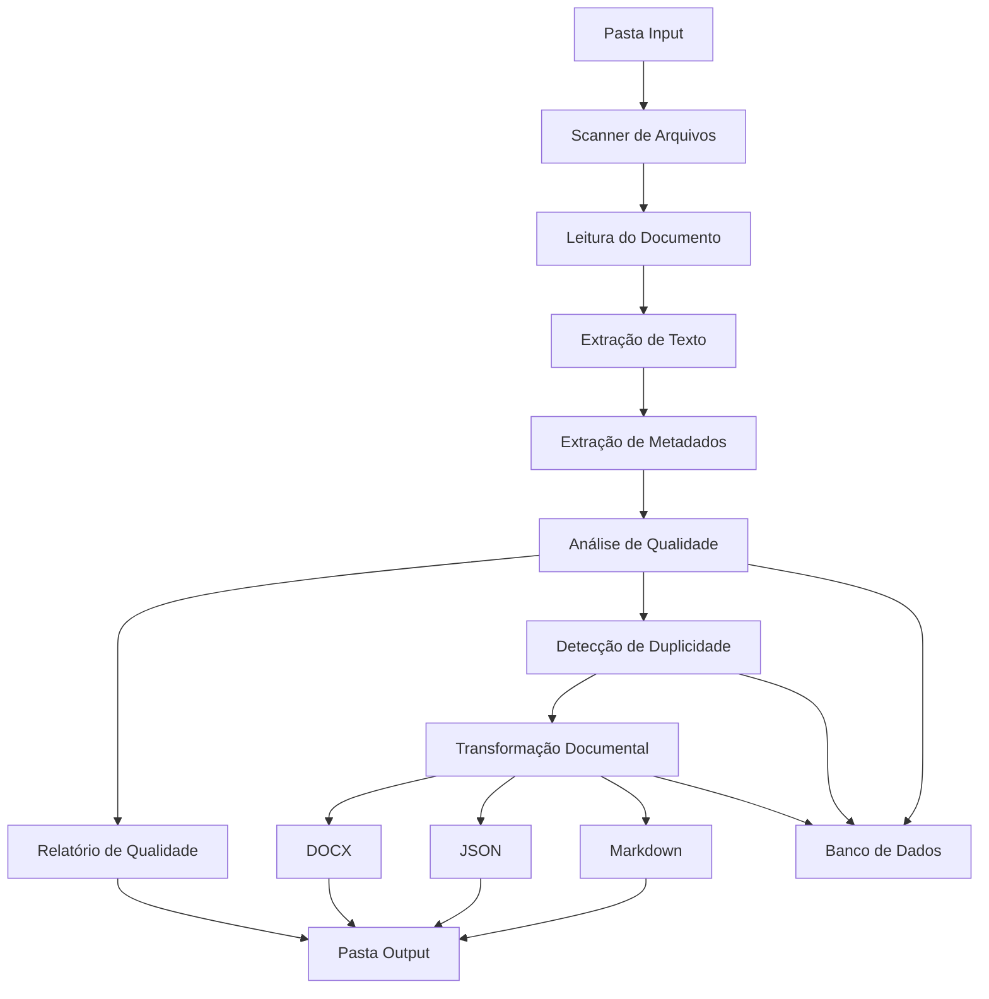

# Sistema para Aprimoramento de RAG de Agentes de IA

## 1. Visão Geral

O Sistema para Aprimoramento de RAG de Agentes de IA é uma aplicação desenvolvida para analisar, avaliar, padronizar e transformar documentos utilizados como fontes de conhecimento para agentes de Inteligência Artificial.
A solução atua como uma camada de preparação documental antes da utilização dos arquivos em pipelines RAG, garantindo maior qualidade, rastreabilidade e governança das informações utilizadas pelos agentes.

---

## 2.  Objetivo

Desenvolver uma aplicação capaz de

- Processar documentos PDF, DOCX e XLSX
- Extrair texto e metadados
- Avaliar a qualidade documental
- Identificar duplicidades em documentos
- Gerar relatórios de análise
- Gerar versões transformadas dos documentos
- Exportar arquivos em:
  - Markdown (.md)
  - JSON (.json)
  - DOCX (.docx)
- Armazenar histórico de processamento
- Registrar transformações e resultados das análises

---

## 3. Arquitetura da Aplicação

### 3.1 Fluxo do Sistema

---

### 3.3 Ferramentas utilizadas

| Camada | Tecnologia |
|----------|----------|
| Back-end | Python |
| Banco de Dados | SQLServer |
| Testes | Pytest |
| Versionamento | Git |
|Front End| HTML e JSON|
| Containerização | Docker |

---

## 4. Conclusão

O Sistema para Aprimoramento de RAG de Agentes de IA será uma ferramenta especializada para preparação e governança de documentos utilizados em agentes de IA.

A aplicação possui uma arquitetura simples, modular e totalmente orientada a processamento back-end.

A solução permitirá:

- Padronizar fontes de conhecimento
- Melhorar a qualidade documental
- Detectar problemas antes da indexação
- Gerar relatórios automáticos
- Manter rastreabilidade das transformações
- Produzir documentos preparados para utilização futura em pipelines RAG

Essa abordagem cria uma base sólida para evolução futura da plataforma sem comprometer simplicidade, manutenção e velocidade de desenvolvimento do MVP.
